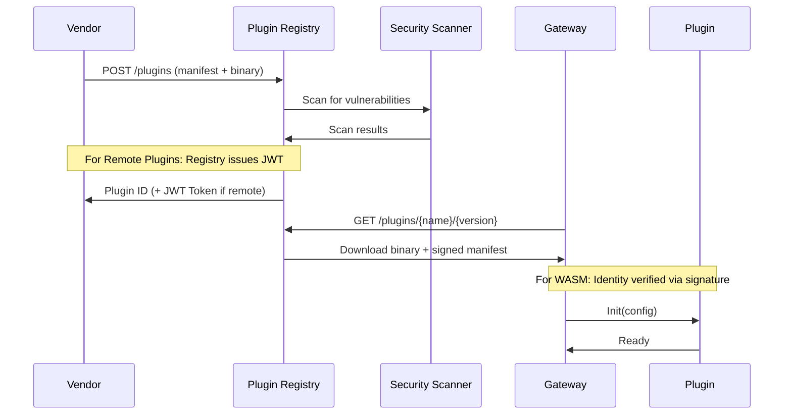

# RM&D OSS Architecture — Part 3: Multi-Vendor Ecosystem & Plugin API

> Part 3 of 6 · Section 6: Standardized interfaces, telemetry schema, plugin lifecycle API, certification program.

> **Navigation:** [ARCH1 Overview](ARCH1_OVERVIEW.md) · [ARCH2 Security & Licensing](ARCH2_VENDOR_SECURITY.md) · [ARCH3 Plugin API](ARCH3_PLUGIN_API.md) · [ARCH4 Deployment](ARCH4_DEPLOYMENT.md) · [ARCH5 OSS Stack](ARCH5_OSS_STACK.md) · [ARCH6 Strategy](ARCH6_STRATEGY.md)

---

### Clarification: Normative vs. Informative
To maintain architectural maintainability and implementation flexibility, readers should distinguish between:

*   **Normative (Mandatory):** Requirements that **must** be implemented to ensure ecosystem compatibility (e.g., Protobuf message schema, lifecycle hooks, mTLS/HMAC integrity, BCA Annex A KPIs).
*   **Informative (Examples):** Example implementations (Go interface, REST/JSON mapping), suggested SDK functions, and placeholder baseline values. These may be substituted with equivalent specialized implementations during the coding phase.

---

## 6. Multi-Vendor Ecosystem Design

### 6.1 Standardized Interfaces

#### 6.1.1 Canonical Telemetry Schema {#6.1.1}

The RM&D ecosystem uses a **canonical telemetry envelope** that supports multi-vendor interoperability (IPD pillar) while allowing component-specific monitoring required for factory-built modules (AMA pillar).

**Design Principles:**
- **BCA Target:** ≥ 85% diagnostics accuracy (DiA) (benchmark required per BCA RM&D Code of Practice for Lifts)
- **Device-agnostic core fields:** All devices (lifts, HVAC, pumps, AMRs) use the same envelope
- **Vendor extensibility:** Custom fields use namespaced keys (e.g., `vendor.acme.vibration_hz`)
- **Time-series optimized:** Primary key = `(device_id, timestamp_ms)` for efficient storage
- **Security-first (End-to-End):** A `signature` field provides **message-level** integrity from the edge device to the final storage or audit engine. While **mTLS** secures the point-to-point *transports* (e.g., Device → Gateway or Gateway → Cloud), the envelope signature ensures telemetry has not been tampered with within intermediate layers (e.g., a multi-tenant gateway).
- **Semantic Interoperability:** Support for **Brick Schema** or **Project Haystack** tagging. This ensures that "Object A" in a vendor's lift is understood as a "Hoist Motor" by any analytics engine, regardless of the vendor.

**Protobuf Schema (Canonical Version):**

```protobuf
syntax = "proto3";
package rmd.telemetry.v1;

message TelemetryEnvelope {
  // Core identification
  string device_id = 1;              // UUID (e.g., "550e8400-e29b-41d4-a716-446655440000")
  string tenant_id = 2;              // Multi-tenancy isolation
  int64 timestamp_ms = 3;            // Unix epoch milliseconds (UTC)

  // Device metadata
  string firmware_version = 4;       // Semantic version (e.g., "1.2.3")
  string device_type = 5;            // "lift", "hvac", "pump", "amr"

  // Payload
  TelemetryType type = 6;            // METRIC, EVENT, ALARM, DIAGNOSTIC
  map<string, Value> payload = 7;    // Standard + vendor fields

  // Security
  // End-to-end message signature for non-repudiation and integrity.
  // Implementation: HMAC-SHA256 (symmetric) or Ed25519 (asymmetric).
  // Algorithm identity and key versioning SHOULD be indicated via 'labels' or 'metadata'.
  bytes signature = 8;

  // Routing and Contextual metadata
  map<string, string> labels = 9;    // "building_id", "floor", "zone", "sig_alg"
}

enum TelemetryType {
  TELEMETRY_TYPE_UNSPECIFIED = 0;
  METRIC = 1;       // Time-series (temperature, RPM)
  EVENT = 2;        // State changes (door opened)
  ALARM = 3;        // Faults (overheat)
  DIAGNOSTIC = 4;   // Health status
}
```

**Standard Payload Fields (by Device Type):**

| Device Type | Standard Fields | Unit | Example Value |
|-------------|----------------|------|---------------|
| **Lift** | `floor_current`, `door_state`, `motor_rpm`, `load_kg` | Floor #, enum, RPM, kg | `5`, `"open"`, `1200`, `450` |
| **HVAC** | `temperature`, `humidity`, `fan_rpm`, `power_kw` | °C, %, RPM, kW | `22.5`, `65`, `1800`, `3.2` |
| **Pump** | `flow_rate`, `pressure`, `vibration`, `power_kw` | L/min, kPa, mm/s, kW | `120`, `350`, `2.1`, `1.5` |
| **AMR** | `battery_pct`, `position_x`, `position_y`, `velocity` | %, m, m, m/s | `85`, `12.3`, `8.7`, `0.5` |

**Vendor Extension Example:**

```json
{
  "device_id": "lift-001",
  "timestamp_ms": 1709481600000,
  "payload": {
    "floor_current": 5,
    "motor_rpm": 1200,
    "vendor.otis.brake_pressure": 120.5,
    "vendor.otis.safety_circuit_status": "ok"
  }
}
```

**JSON Representation (for HTTP/REST APIs):**

```json
{
  "device_id": "550e8400-e29b-41d4-a716-446655440000",
  "tenant_id": "acme-corp",
  "timestamp_ms": 1709481600000,
  "firmware_version": "2.3.1",
  "device_type": "hvac",
  "type": "METRIC",
  "payload": {
    "temperature": 22.5,
    "humidity": 65,
    "fan_rpm": 1800,
    "power_kw": 3.2
  },
  "signature": "base64-encoded-hmac-sha256",
  "labels": {
    "building_id": "building-A",
    "floor": "3",
    "zone": "north"
  }
}
```

1.  **Interoperability:** Any RM&D platform can parse any device's telemetry.
2.  **Time-series efficiency:** `(device_id, timestamp_ms)` is optimal for high-throughput time-series databases (e.g., QuestDB, TimescaleDB, or BigTable).
3.  **Multi-tenancy:** `tenant_id` enables SaaS deployments with data isolation.
4.  **Debugging:** `firmware_version` correlates faults with software versions.
5.  **Security:** `signature` field prevents man-in-the-middle tampering.
6.  **Vendor freedom:** Namespaced extensions (`vendor.*`) avoid collisions.

For detailed plugin API usage of this schema, see [Section 6.3.2](#632-input-telemetryenvelope-structure).

#### 6.1.2 Device-to-Gateway Interface

-   **Protocols:** MQTT 5.0 (primary), HTTP/2 (fallback), CoAP (constrained devices)
-   **Serialization:** Protobuf (binary) for bandwidth efficiency, JSON for debugging
-   **Security:** X.509 client certificates + mTLS
-   **QoS:** MQTT QoS 1 (at least once delivery) for critical telemetry

**MQTT Topic Structure:**

```
rmd/{tenant_id}/telemetry/{device_type}/{device_id}
```

Example: `rmd/acme-corp/telemetry/hvac/550e8400-e29b-41d4-a716-446655440000`

#### 6.1.3 Gateway-to-Cloud Interface

-   **Ingestion API:** gRPC with Protobuf (high throughput) or REST with JSON (compatibility)
-   **Authentication:** JWT tokens (short-lived, 1h expiry) + API keys (long-lived, gateway identity)
-   **Batching:** Gateways batch telemetry in **typical 5s windows** (provisional default, tunable via policy).
-   **Compression:** gRPC uses built-in compression; HTTP uses gzip

**gRPC Service Definition:**

```protobuf
service TelemetryIngest {
  rpc SendBatch(TelemetryBatch) returns (IngestResponse);
  rpc SendStream(stream TelemetryEnvelope) returns (IngestResponse);
}

message TelemetryBatch {
  repeated TelemetryEnvelope envelopes = 1;
  string gateway_id = 2;
}
```

#### 6.1.4 Vendor Plugin API (Data Plane)

The RM&D platform supports high-performance plugins for real-time telemetry processing.

*   **Normative Protocol (Gateway/Runtime):** **gRPC + Protobuf**. This is the required interface for edge and gateway-based components where throughput and latency are critical.
*   **Normative Runtime:** **WebAssembly (WASM)** for sandboxing or **Docker containers** for complex analytics.
*   **Data Access:** Read-only access to device telemetry (tenant-scoped).
*   **Output:** Enriched telemetry, alerts, and predictions.

**See [Section 6.3 - Minimum Viable Plugin API](#63-minimum-viable-plugin-api-specification) for the Protobuf/gRPC spec.**

#### 6.1.5 Cloud Service API (Management Plane)

The cloud platform provides administrative and integration interfaces.

*   **Normative Protocol:** **REST over HTTPS** (documented via **OpenAPI 3.1**).
*   **Use Cases:** Plugin registration, tenant management, alert webhooks, and historical data retrieval.
*   **Observability:** Grafana plugin API for custom dashboards.

### 6.2 Certification & Compliance Program

**Device Certification:**
- Devices passing certification can display "Singapore RM&D Compatible" badge
- Automated test suite verifies:
  - Telemetry schema compliance
  - Security requirements (IMDA IoT Guide, IEC 62443-4-2)
  - Performance benchmarks (latency, throughput)

**Plugin Certification:**
- Plugins are tested for:
  - Sandbox compliance (no unauthorized access)
  - Resource limits (CPU, memory)
  - API compatibility
  - Security scan (vulnerability assessment)

**Cloud Platform Certification:**
- Commercial platforms can certify compatibility with OSS core
- Ensures customers can migrate between OSS self-hosted and commercial managed

### 6.3 Minimum Viable Plugin API Specification

This section defines the **concrete, implementable API** that enables vendors to build plugins for the RM&D ecosystem while protecting their proprietary IP.

#### 6.3.1 Plugin Lifecycle Hooks

Every plugin MUST implement these lifecycle methods:

```go
// Plugin Interface Definition
type Plugin interface {
    // Initialize plugin with configuration
    // Called once during plugin load
    Init(config PluginConfig) error

    // Process incoming telemetry data
    // Called for each telemetry batch
    Process(envelope TelemetryEnvelope) (PluginResult, error)

    // Health check for monitoring
    // Called periodically by runtime
    HealthCheck() HealthStatus

    // Graceful shutdown
    // Called before plugin unload
    Shutdown() error
}
```

**Lifecycle Sequence:**
1. `Init()` - Load configuration, initialize models, establish connections.
2. `Process()` - Continuously handle telemetry stream.
3. `HealthCheck()` - Periodic monitoring (**every 30s default**, configurable).
4. `Shutdown()` - Cleanup resources before termination.

> [!TIP]
> **SDK Naming Conventions:** While the core specification uses PascalCase for methods (as seen in the Go interface), language-specific SDKs SHOULD follow idiomatic naming (e.g., `snake_case` for Python) to ensure a natural developer experience.

#### 6.3.2 Input: TelemetryEnvelope Structure

The plugin input uses the **Canonical Telemetry Envelope** defined in [Section 6.1.1](#6.1.1).

**Key Design Rationale (from §6.1.1):**
- **device_id + timestamp_ms**: Primary key for time-series storage.
- **tenant_id**: Mandatory for multi-tenant SaaS deployments.
- **firmware_version**: Critical for correlation with bug reports and updates.
- **payload as map**: Allows vendor extensibility without schema changes.
- **signature**: Prevents tampering in transit (gateway validates before processing).

#### 6.3.3 Output: PluginResult Structure

Plugins return enriched data and insights:

```protobuf
message PluginResult {
  // Enriched telemetry (original + calculated fields)
  map<string, Value> enriched_data = 1;

  // Generated alerts
  repeated Alert alerts = 2;

  // Predictive analytics
  repeated Prediction predictions = 3;

  // Plugin execution metadata
  PluginMetadata metadata = 4;
}

message Alert {
  string alert_id = 1;               // UUID
  string severity = 2;               // "critical", "warning", "info"
  string title = 3;                  // "Motor overheat detected"
  string description = 4;            // Detailed explanation
  int64 triggered_at = 5;            // Unix epoch milliseconds
  map<string, string> tags = 6;      // "component": "motor", "zone": "A"
}

message Prediction {
  string prediction_type = 1;        // "failure_probability", "remaining_useful_life"
  double confidence = 2;             // 0.0 to 1.0
  int64 predicted_at = 3;            // Unix epoch (when event expected)
  map<string, Value> details = 4;    // Model-specific outputs
}

message PluginMetadata {
  string plugin_id = 1;
  string version = 2;
  int64 processing_time_ms = 3;      // For performance monitoring
}
```

#### 6.3.4 Security Model

**1. Plugin Authentication & Identity**
- **In-Process (WASM) Plugins:** Identity is tied to the **cryptographically signed plugin package**. The runtime verifies the signature and manifest on load. Access is controlled via **capability-based security** (host functions and WASI permissions); no JWT is required for internal calls.
- **Out-of-Process (gRPC/Docker) Plugins:** Mutual authentication via **mTLS** plus a **JWT Bearer Token** for granular capability control. The token (issued by the Plugin Registry) contains `plugin_id`, `tenant_id`, and `permissions[]`.

**2. Data Access Control**
- Plugins have **read-only** access to telemetry matching their `tenant_id`
- Cross-tenant access strictly forbidden (enforced at runtime)
- Plugins cannot access raw database or message broker

**3. Resource Limits (WASM Sandbox - Default Baseline)**

Resource limits are defined per-tenant and per-plugin. The following values represent a **typical baseline** for building integration plugins:

```yaml
# Typical baseline plugin resource constraints (tunable via Policy-as-Code)
max_memory: 256MB
max_cpu: 0.5 cores
max_execution_time: 5s per invocation
max_network_connections: 10
allowed_syscalls: [read, write, stat]  # No exec, fork
```

**4. Network Restrictions**
- Plugins can only make HTTP calls to pre-approved endpoints (whitelist)
- Example: vendor's ML model serving API
- All external calls logged for audit

#### 6.3.5 API Interface Options

**Option A: gRPC / Protobuf (Normative for Data Plane)**

```protobuf
service PluginService {
  rpc Init(PluginConfig) returns (InitResponse);
  rpc Process(TelemetryEnvelope) returns (PluginResult);
  rpc HealthCheck(Empty) returns (HealthStatus);
  rpc Shutdown(Empty) returns (ShutdownResponse);
}
```

- **Pros:** Maximum performance for high-throughput edge/gateway telemetry.
- **Support:** Native WASM imports/exports use these core function signatures.

**Option B: REST / HTTP (Normative for Cloud Integration)**

```bash
# Example invocation for remote cloud-based plugins
POST /v1/process
Content-Type: application/json
Authorization: Bearer <JWT>
```

- **Pros:** Language-agnostic; easiest integration for model-serving (Python/MLflow).
- **Format:** Body uses the [JSON-mapped TelemetryEnvelope](#6.1.1).

**Recommendation:** Use **gRPC/WASM** for production gateway plugins (Data Plane) and **REST/OpenAPI** for cloud-based analytics or webhooks (Management/Cloud Plane).

#### 6.3.6 Plugin Discovery & Registration

**1. Plugin Manifest (plugin.yaml)**

```yaml
apiVersion: rmd.sg/v1
kind: Plugin
metadata:
  name: acme-hvac-diagnostics
  version: 2.1.0
  vendor: ACME Corp
spec:
  runtime: wasm  # choices: wasm, grpc, docker
  entry_point: plugin.wasm
  device_types: [hvac]
  required_fields: [temperature, humidity, fan_rpm]
  permissions:
    - telemetry:read
    - alerts:write
  resource_limits:
    memory: 128Mi
    cpu: 250m
```

**Plugin Runtime Comparison:**

| Runtime | Execution Environment | Isolation Mechanism | Primary Interface | Typical Use Case |
| :--- | :--- | :--- | :--- | :--- |
| **wasm** | In-process (Gateway) | WASM Sandbox (Linear Memory) | Host Function Calls | High-frequency telemetry filtering, stateless analytics. |
| **grpc** | Out-of-process (Sidecar) | Process Isolation | gRPC + Protobuf | Statefull logic, cross-language support, moderate compute. |
| **docker** | Out-of-process (Container) | Cgroups / Namespaces | gRPC or REST | Heavy ML models, GPU acceleration, legacy dependency trees. |

**Security Note:** Out-of-process runtimes (**grpc**, **docker**) MUST communicate via the [PEPs defined in §4.2.6](ARCH2_VENDOR_SECURITY.md#4.2.6) and use mTLS for transport security.

**2. Registration & Activation Flow**



#### 6.3.7 Minimum Viable API Example (Python)

```python
from rmd_plugin_sdk import Plugin, TelemetryEnvelope, PluginResult, Alert

class HVACDiagnosticPlugin(Plugin):
    def init(self, config):
        self.temp_threshold = config.get("overheat_threshold", 80.0)
        self.model = load_ml_model(config.get("model_path"))

    def process(self, envelope: TelemetryEnvelope) -> PluginResult:
        temp = envelope.payload.get("temperature")

        # Generate alert if overheat
        alerts = []
        if temp > self.temp_threshold:
            alerts.append(Alert(
                severity="critical",
                title="HVAC Overheat",
                description=f"Temperature {temp}°C exceeds {self.temp_threshold}°C"
            ))

        # Predict failure probability
        failure_prob = self.model.predict(envelope.payload)

        return PluginResult(
            enriched_data={"failure_probability": failure_prob},
            alerts=alerts
        )

    def health_check(self):
        return {"status": "healthy", "model_loaded": self.model is not None}

    def shutdown(self):
        self.model.close()
```

#### 6.3.8 OpenAPI 3.1 Specification

For cloud-based plugins and management operations, the following REST interface is supported:

```yaml
openapi: 3.1.0
info:
  title: RM&D REST Plugin API
  version: 1.0.0
paths:
  /v1/process:
    post:
      summary: Process telemetry batch via Cloud/REST
      requestBody:
        content:
          application/json:
            schema:
              $ref: '#/components/schemas/TelemetryEnvelope'
      responses:
        '200':
          description: Processed successfully
          content:
            application/json:
              schema:
                $ref: '#/components/schemas/PluginResult'
      security:
        - PluginJWT: []  # Required for remote HTTP plugins
```

(Full OpenAPI specification available in `/specs/plugin-api.yaml` in reference implementation repository)

#### 6.3.9 Testing & Validation

**Plugin Certification Test Suite:**

1. **Functional Tests**
   - Valid telemetry → Expected output
   - Missing fields → Graceful error handling
   - Invalid tenant_id → Access denied

2. **Security Tests**
   - Cross-tenant data access → Blocked
   - Unauthorized syscalls → Sandbox violation
   - Resource limit exceeded → Process terminated

3. **Performance Tests**
   - 1000 msg/s throughput
   - <50ms p95 latency
   - <256MB memory footprint

**Example Test Case:**

```python
def test_plugin_tenant_isolation():
    plugin = load_plugin("acme-hvac-diagnostics")

    # Envelope from Tenant A
    envelope_a = TelemetryEnvelope(tenant_id="tenant-a", device_id="device-1")

    # Plugin configured for Tenant B
    plugin.init(PluginConfig(tenant_id="tenant-b"))

    # Should reject cross-tenant data
    with pytest.raises(PermissionDenied):
        plugin.process(envelope_a)
```

---

### 6.4 Versioning & Compatibility Guarantees

As the RM&D platform evolves, these rules ensure that building owners can maintain stable operations while vendors roll out new capabilities.

#### 6.4.1 Telemetry Envelope (v1) Versioning

The `rmd.telemetry.v1` Protobuf package follows these strict compatibility rules:
- **Additive Only:** New fields may only be added with unique field numbers.
- **No Re-use:** Field numbers 1–15 are reserved for high-frequency core metadata; once allocated, they are never re-used.
- **Deprecation Cycle:** Fields marked as `deprecated` must be supported by the platform for at least 12 months before removal.

#### 6.4.2 Plugin API Semantic Versioning

The Plugin SDK and Runtime interfaces follow **Semantic Versioning (SemVer) 2.0.0**:
- **Patch (x.y.Z):** Bug fixes and performance optimizations with no API changes.
- **Minor (x.Y.z):** New optional lifecycle hooks or utility host functions (backwards compatible).
- **Major (X.y.z):** Breaking changes to message structures or required interface methods.

#### 6.4.3 Manifest Compatibility

The `apiVersion` field in `plugin.yaml` (e.g., `rmd.sg/v1`) defines the runtime capability requirements.
- **LTS Support:** The RM&D Gateway Runtime MUST support the current `apiVersion` and at least **one previous major version** to allow staggered vendor updates.
- **Breaking Changes:** A bump in `apiVersion` signifies a requirement for a runtime upgrade.

---

### 6.5 Third-Party Data Sharing & Interoperability {#6.5-data-sharing}

To achieve the **Smart Nation** vision, data collected by the Nexus platform must be accessible to third-party innovators (e.g., energy consultants, research institutions, app developers) while maintaining strict tenant privacy and security.

#### 6.5.1 The "Data Handshake" Mechanism

Nexus implements a **Request-Consent-Delegate** flow to enable secure data sharing:

1. **Request:** A third party requests access to specific data points (e.g., "Hourly energy consumption for Building X") via the **Nexus Data Marketplace**.
2. **Consent:** The **Asset Owner (Tenant)** receives a notification and explicitly approves or denies the request via the Management Console.
3. **Delegate:** Upon approval, the platform issues a **Scoped Access Token (OAuth2/OIDC)** to the third party, restricted to the approved data range and time duration.

#### 6.5.2 Standardized Egress Interfaces

Third parties can consume data through two primary pathways:

| Interface Type | Protocol | Use Case |
|:--- |:--- |:--- |
| **Historical API** | REST / GraphQL | Research, periodic reporting, and auditing. |
| **Real-time Stream** | Webhooks / NATS | Real-time dashboards, mobile apps, and emergency response. |
| **Data Lakehouse** | **Trino / Iceberg** | **Zero-Copy Data Sharing.** Provides direct, federated access to raw data without expensive ETL/copy costs. |

**Example: Scoped GraphQL Query for Third Parties**

```graphql
query GetBuildingEfficiency($buildingId: ID!) {
  building(id: $buildingId) {
    energyConsumption(unit: KWH, interval: HOURLY) {
      timestamp
      value
    }
    equipmentHealth(type: LIFT) {
      deviceId
      status
      lastMaintenance
    }
  }
}
```

#### 6.5.3 Data Governance & Anonymization

To comply with PDPA and government data security policies, the platform provides **Anonymization Hooks**:

- **PII Stripping:** Automatically removes personal identifiers (e.g., maintenance personnel names, specific tenant suite numbers) before egress.
- **Data Aggregation:** Provides "k-anonymized" data sets (e.g., average building temperature instead of room-level data) for research purposes.
- **Audit Logging:** Every data access event by a third party is logged in an immutable audit trail.

> [!IMPORTANT]
> **Sovereignty First:** All data sharing MUST occur within the platform's geographical boundaries (Singapore) unless explicitly waived by the data owner and regulator.
```
